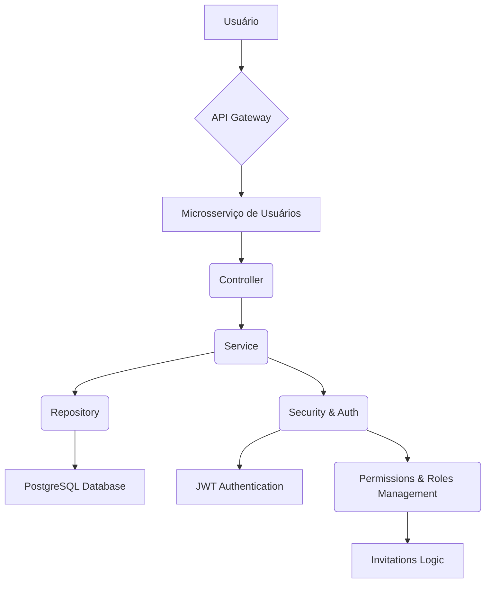

# CollabHubBR - Users Management


<!--  -->

Este repositório contém o código-fonte do **Microsserviço de Usuários** do **CollabHubBR**, a plataforma brasileira de coordenação e organização de projetos de código-aberto. Desenvolvido em **Java** com o framework **Spring**, este serviço é o pilar para o gerenciamento de todas as entidades relacionadas a usuários na plataforma.

As principais responsabilidades deste microsserviço incluem a gestão de **usuários**, **perfis**, **permissões** e **grupos**. Ele orquestra o sistema de autorização, permitindo que usuários criadores de projetos convidem outros usuários para se tornarem administradores de projetos, definindo permissões específicas. Isso pode ser concedido como `superuser` (todas as permissões) ou por **roles detalhadas**, como `KanbanRole`, `PollRole`, `RoadmapRole`, entre outras. A persistência dos dados é garantida pelo **PostgreSQL**, oferecendo robustez e escalabilidade.

## Stack


<!--  -->
<!--  -->


<!--  -->


## Arquitetura

A arquitetura do Microsserviço de Usuários do CollabHubBR segue os princípios de microsserviços, focando na **separação de responsabilidades**, **escalabilidade** e **manutenibilidade**. Adotamos uma estrutura de pacotes modular para organizar nossas entidades, controladores, serviços, repositórios e configurações.



### Estrutura de Pastas

Abaixo, descrevemos a organização principal dos pacotes do projeto:

- `src/main/java/br/com/collabhubbr/users/`: Pacote raiz do código-fonte.
  - `config/`: Classes de configuração do Spring (segurança, banco de dados, etc.).
  - `controller/`: Endpoints REST para interações com o serviço (gerenciamento de usuários, perfis, convites).
  - `model/`: Classes de entidade que mapeiam as tabelas do banco de dados (User, Profile, Permission, Role, Group, Invitation).
  - `repository/`: Interfaces JPA para acesso e manipulação de dados no PostgreSQL.
  - `service/`: Lógica de negócio, orquestração e validação (criação de usuários, atribuição de roles, gerenciamento de convites).
  - `security/`: Implementações de segurança (autenticação, autorização, JWT).
  - `util/`: Classes utilitárias e helpers.
  - `CollabhubbrUsersApplication.java`: Classe principal da aplicação Spring Boot.
- `src/main/resources/`:
  - `application.properties` ou `application.yml`: Arquivos de configuração do Spring (conexão com o banco de dados, portas, etc.).
- `src/test/java/br/com/collabhubbr/users/`: Pacotes para testes unitários e de integração.

### Instalação de Dependências

```bash
mvn clean install
```

### Configuração do Banco de Dados

Crie um banco de dados PostgreSQL e configure as credenciais no `src/main/resources/application.properties` (ou `application.yml`):

```properties
spring.datasource.url=jdbc:postgresql://localhost:5432/collabhub_users_db
spring.datasource.username=seu_usuario
spring.datasource.password=sua_senha
spring.jpa.hibernate.ddl-auto=update
spring.jpa.show-sql=true
```

### Servidor Local

```bash
mvn spring-boot:run
```

### Execução de Testes

```bash
mvn test
```

## To-Do List

Confira a [To-Do List aqui](https://github.com/CollabHubBR/users-management/blob/main/.github/TODO.md)

## Contrib

Antes de contribuir ativamente com o projeto é **fortemente recomendada** a leitura dos documentos abaixo:

- [Código de Conduta](https://github.com/CollabHubBR/.github/blob/main/CODE_OF_CONDUCT.md)
- [Contribuindo](https://github.com/CollabHubBR/.github/blob/main/CONTRIBUTING.md)
- [Segurança](https://github.com/CollabHubBR/.github/blob/main/SECURITY.md)
- [Suporte](https://github.com/CollabHubBR/.github/blob/main/SUPPORT.md)

## Licença

This project is under [MIT - Massachusetts Institute of Technology](https://choosealicense.com/licenses/mit/). A short and simple permissive license with conditions only requiring preservation of copyright and license notices. Licensed works, modifications, and larger works may be distributed under different terms and without source code.
